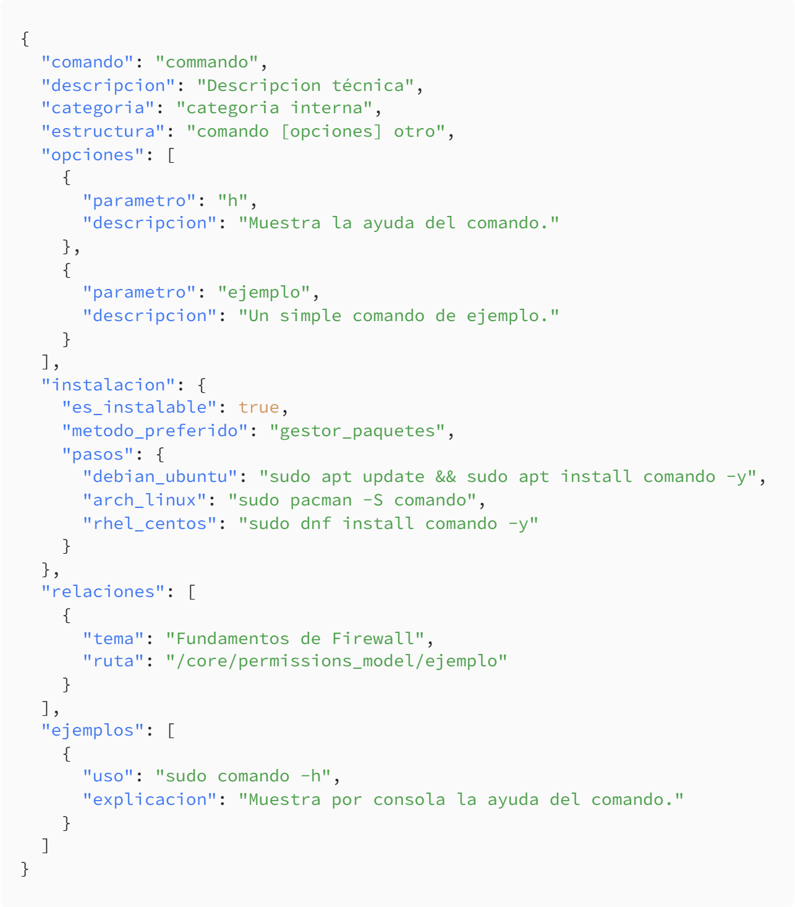

<p align="center">
  
</p>
<div align="center">
<h1>LinuxCore</h1>

**El repositorio definitivo de Linux en Español**

[](LICENSE) [](https://github.com/nisamov/linuxcore/commits) [](.)

**Un repositorio creado con la simple finalidad de aprender sin depender de tutoriales genéricos, cursos de pago o fuentes poco seguras.**

</div>

---

## Descripción del Proyecto

**LinuxCore** es un repositorio creado a raíz de su predecesor [LinuxCommands](https://github.com/nisamov/LinuxCommands), con el fin de suplir la ambiciosa finalidad de albergar y ofrecer conocimiento absoluto sobre Linux, no solo con el propósito de sustituir al repositorio previo, sino de consolidar años de experiencia en sistemas Linux, arquitectura, prácticas de seguridad e infraestructuras modernas.

### Arquitectura del Proyecto

El proyecto genera automáticamente bases de datos estructuradas en formato JSON que permiten indexar y consultar determinadas zonas de contenido de manera eficiente. Estas bases de datos incluyen:

- **Comandos del Sistema**: Indexación completa de comandos Linux con sintaxis, opciones, ejemplos y casos de uso
- **Servicios del Sistema**: Documentación de servicios y procesos del sistema
- **Protocolos de Red**: Especificaciones técnicas de protocolos y protocolos de aplicación
- **Búsqueda Avanzada**: Capacidad de búsqueda por etiquetas, categorías y dependencias

La base de datos se actualiza automáticamente con cada contribución, manteniendo la integridad y consistencia de toda la documentación.

---

## Contenido

Esta documentación está organizada en los siguientes dominios principales:

### Fundamentos (`core/`)
- Filosofía Linux y Principios de Diseño
- Proceso de Arranque e Inicialización del Sistema
- Modelo de Procesos y Programación
- Gestión de Memoria y Memoria Virtual
- Estándar de Jerarquía del Sistema de Archivos (FHS)
- Usuarios, Grupos y Modelo de Permisos
- Señales e IPC (Comunicación Inter-Proceso)
- Entorno Shell y Configuración

### Sistemas (`kernel/`, `networking/`)
- Arquitectura del Kernel e Internals
- Gestión de Procesos y Cambio de Contexto
- Protocolos de Red e Implementación de Stack
- Conceptos TCP/IP y Configuración

### Seguridad (`security/`)
- **Defensiva**: Fortalecimiento, Control de Acceso, Detección de Intrusiones
- **Ofensiva**: Pruebas de Penetración, Técnicas de Explotación
- **Forense y Análisis**: Análisis de procesos, servicios e investigación de memoria
- **Cumplimiento y Estándares**: Cumplimiento de estandares de seguridad informática

### Tecnologías Modernas
- **Contenedorización**: Arquitectura Docker y uso
- **Orquestación**: Patrones de despliegue Kubernetes
- **Virtualización**: Hipervisores y gestión de VM
- **Infraestructura Cloud**: Estrategias de despliegue

### Recursos Prácticos
- **Labs y Ejercicios**: Módulos de aprendizaje práctico
- **Automatización**: Bash, Python y scripting
- **Referencia de Comandos**: Herramientas y utilidades esenciales
- **Guías de Solución de Problemas**: Problemas comunes y soluciones

---

## Estructura de los comandos

Esta es la estructura del cuerpo de los comandos en formato `json`:
<!---->
```json
{
  "comando": "commando",
  "descripcion": "Descripcion técnica",
  "categoria": "categoria interna",
  "estructura": "comando [opciones] otro",
  "opciones": [
    {
      "parametro": "h",
      "descripcion": "Muestra la ayuda del comando."
    },
    {
      "parametro": "ejemplo",
      "descripcion": "Un simple comando de ejemplo."
    }
  ],
  "instalacion": {
    "es_instalable": true,
    "metodo_preferido": "gestor_paquetes",
    "pasos": {
      "debian_ubuntu": "sudo apt update && sudo apt install comando -y",
      "arch_linux": "sudo pacman -S comando",
      "rhel_centos": "sudo dnf install comando -y"
    }
  },
  "relaciones": [
    {
      "tema": "Fundamentos de Firewall",
      "ruta": "/core/permissions_model/ejemplo"
    }
  ],
  "ejemplos": [
    {
      "uso": "sudo comando -h",
      "explicacion": "Muestra por consola la ayuda del comando."
    }
  ]
}
```
Estando en este formato, es posible filtras los comandos según sus parámetros, categoría o relaciones internas.

---

Este es un proyecto de carácter personal desarrollado con fines de aprendizaje. Cualquier contribución, sugerencia o difusión es sumamente valorada y bienvenida.
<div align="center">
  <p><b>Linux Core - Nisamov | MIT License - 2026</b></p>
  <p><b>Contacto:</b> <a href="mailto:nisamov.contact@gmail.com">nisamov.contact@gmail.com</a></p>
  <p align="center">
    
  </p>
</div>
</div>